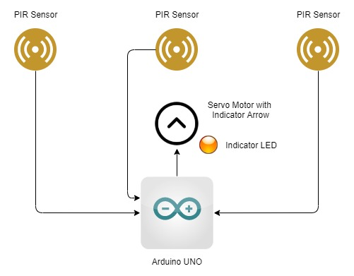

# ESProject - A Simple Classic Burgler Alarm System

This project is done as a fulfillment to the module Embedded Systems of my degree program BSc. (Hons.) in Information Technology. This project is about a basic concept 'Burglar Alarm System' using Passive Infrared Sensors and Arduino microcontroller.

This repository contains the source code for the Arduino Uno board which is powered by ATMega 328P. The source code is written in C language. 

## System Overview

The system conains 3 Passive Infrared Sensors, a servo motor, a LED other than to the Arduino board. The PIR sensors are positioned in 3 directions and the servo motor with indicator LED is placed perpendicular to the 3 PIR sensors as shown in the following diagram.

### Pin Layout
- Left PIR - Digital Pin 7
- Center PIR - Digital Pin 6
- Right PIR - Digital Pin 5
- Servo Motor - Digital Pin 2
- Indicator LED - Digital Pin 0

Once any of the PIR sensors gives feedback, the servo motor will rotate the LED to that specific PIR sensor and LED will light up. 
